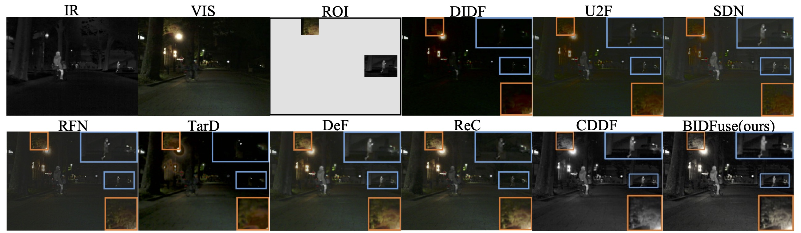

# BIDFuse: Harnessing Bi-Directional Attention with Modality-Specific Encoders for Infrared-Visible Image Fusion (ICIP 2024)

[Wangzhi Xing](https://github.com/zzowenzz), [Diqi Chen](https://experts.griffith.edu.au/44378-diqi-chen), [Mohammad Aminul Islam](https://scholar.google.com.au/citations?user=I7umFP0AAAAJ&hl=en), [Jun Zhou](https://scholar.google.com.au/citations?user=6hOOxw0AAAAJ&hl=en)

[Paper]
Our code is based on CDDFuse, which is available [here](https://github.com/Zhaozixiang1228/MMIF-CDDFuse)


## Abstract
Infrared-visible image fusion aims to utilize the distinct advantages of each modality to provide a more comprehensive representation than either one could offer. Current state-of-the-art methods segregate encoded features into modality-specific features and modality-independent features. However, this segregation often fails to effectively isolate feature representation from different modalities, which causes possible information loss,  rendering overly complex and ultimately unnecessary design. To tackle this issue, we propose BIDFuse, a novel two-stage bi-directional fusion network, designed to leverage the unique features from both modalities without explicit feature separation. We first use two encoders to specifically extract critical information from the two input images. Additionally, a cross-feeding mechanism is implemented to feed the features from one encoder directly into the input stream of the other decoder, enhancing the reconstruction process with information from both sources. Then, the bi-directional attention module is designed to fuse the features from both modalities and generate a fused image. Competitive experimental results demonstrate the effectiveness of our method for image fusion on the MSRS dataset and for low-light object detection on the M3FD dataset.


## Installation
Note that the code is tested in Ubuntu 20.04. The code may work with other versions, but we do not guarantee it.
```
# create a new conda environment
conda create -n bidfuse python=3.10
# activate the environment
conda activate bidfuse
# install pytorch and torchvision from pytorch and nvidia channels
conda install pytorch torchvision pytorch-cuda=12.1 -c pytorch -c nvidia
# install other dependencies
pip install -r requirements.txt
```

## Dataset
We evaluate our method on the [MSRS](https://github.com/Linfeng-Tang/MSRS) and [M3FD](https://github.com/JinyuanLiu-CV/TarDAL/tree/main) dataset. 

MSRS dataset contains total 1444 pairs of aligned infrared and visible images, with 1083 pairs for training and 361 pairs for testing. The images are of size $480 \times 640$. The label files are also provided in YOLO format.

M3FD dataset contains total 4200 pairs of aligned infrared and visible images, with 2940 pairs for training and 1260 pairs for testing. The images are of size $1024 \times 769$. The label files are also provided in YOLO format.


## Usage
### Testing
To test our pre-trained model, first download the model from [here](https://drive.google.com/file/d/1).
Then, you can run the following command:
```
python infer.py --dataset <dataset name> --checkpoint <path to the model>
```
The testing results are reported below in the Experiments section.


### Training
To train the model, you can run the following command:
```
python train.py --name <experiment name> --project <project name on wandb> --dataset <dataset name> --imgsz <image size> --batch_size <batch size> --epochs <number of total epochs> --epoch_gap <number of epochs for the first training stage> --batch_size <batch size>
```
For more training options, you can refer to the `train.py -h` command.


## Experiments on MSRS dataset for fusion


## Experiments on M3FD dataset for object detection


## Visualization of fusion results


